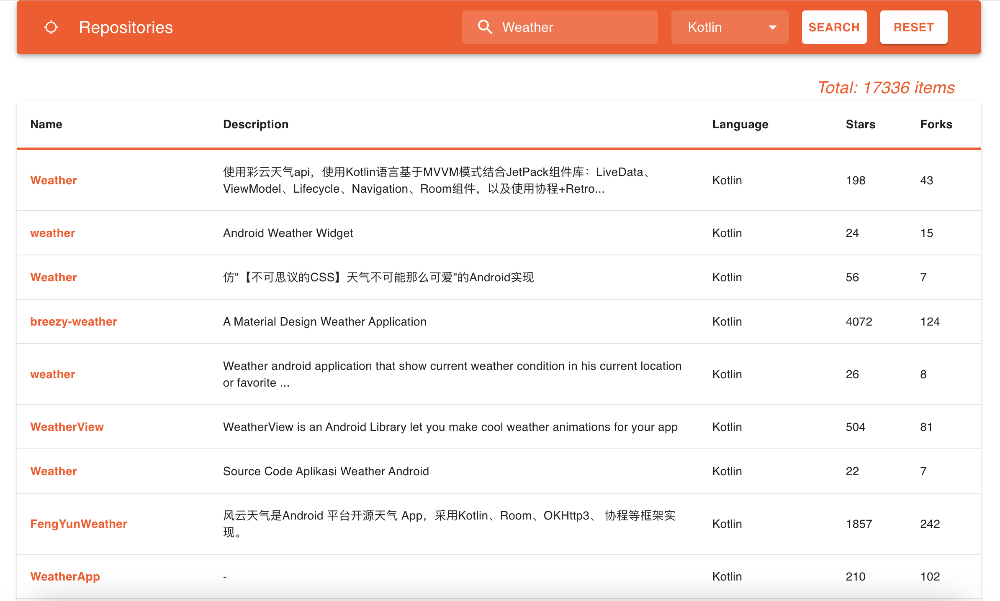

# GitHub Repository Search App

<p align="center">
  
</p>

This project is a web application for searching GitHub repositories using the GitHub API. It is built using the following technologies:

- Node.js
- Express
- React
- Axios
- TypeScript
- Material-UI

## Table of Contents

- [Features](#features)
- [Installation](#installation)
  - [Prerequisites](#prerequisites)
  - [Backend](#backend)
  - [Frontend](#frontend)
- [Usage](#usage)

## Features

- Search GitHub repositories by name
- Display search results in a paginated table
- Filter and sort results
- Responsive UI built with Material-UI

## Installation

### Prerequisites

Make sure you have the following installed on your machine:

- Node.js (>=14.x)
- npm (>=6.x) or yarn (>=1.x)

### Steps

1. Clone the repository:

    ```sh
    git clone https://github.com/ChrisHryts/gh-repo-search.git
    cd gh-repo-search
    ```

2. Install backend dependencies:

    ```sh
    cd backend
    npm install
    ```

3. Start the backend server:

    ```sh
    npm start
    ```

4. Install frontend dependencies:

    ```sh
    cd ../frontend
    npm install
    ```

5. Start the frontend development server:

    ```sh
    npm start
    ```

## Usage

1. Open your web browser and navigate to `http://localhost:3001`.
2. Use the search bar to enter a repository name and view the results.
